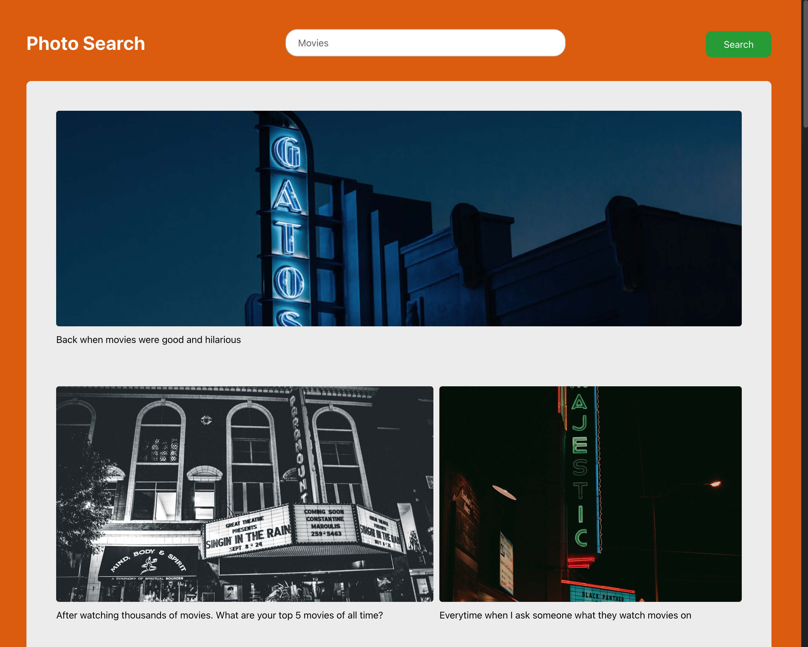

# Photo Search Application

A dynamic web application that combines visual content from Unsplash with related text content from Reddit to create an engaging photo browsing experience.


*Screenshot of the Photo Search application showing search results for "Movies"*

## Overview

This application allows users to search for photos using keywords, fetches relevant images from the Unsplash API, retrieves related text content from Reddit, and displays the results in a responsive gallery layout.

## Features

- **Keyword-based Search**: Search for photos using any keyword
- **API Integration**: Fetches high-quality images from Unsplash API
- **Content Enrichment**: Pairs images with relevant text content from Reddit
- **Responsive Design**: Gallery layout adapts to different screen sizes
- **Error Handling**: Robust error handling for API requests

## Project Structure

```
photo-search/
├── index.html        # Main HTML file with the user interface
├── style.css         # Main stylesheet for the application
├── reset.css         # CSS reset for consistent styling
├── photo-search.js   # Main JavaScript file handling API requests and DOM manipulation
├── server.js         # Node.js proxy server for Reddit API requests
├── config.js         # Configuration file for API keys
└── .gitignore        # Git ignore file
```

## Technologies Used

- **Frontend**: HTML5, CSS3, JavaScript (ES6+)
- **Backend**: Node.js, Express
- **APIs**: Unsplash API, Reddit API
- **Networking**: Fetch API, CORS handling
- **Styling**: Flexbox for responsive layout

## Setup and Installation

### Prerequisites

- Node.js (v14 or higher)
- npm (Node Package Manager)
- Unsplash API key

### Installation Steps

1. Clone the repository or navigate to the photo-search directory:
   ```
   cd gui/photo-search
   ```

2. Install the required dependencies:
   ```
   npm install express node-fetch cors
   ```

3. Configure your Unsplash API key:
   - Open `config.js`
   - Replace the existing API key with your own Unsplash API key
   ```javascript
   const accessKEY = 'YOUR_UNSPLASH_API_KEY';
   ```

4. Start the proxy server:
   ```
   node server.js
   ```

5. Open `index.html` in your web browser

## How It Works

1. **User Input**: User enters a search term in the search box
2. **Image Retrieval**: Application fetches relevant images from Unsplash API
3. **Content Retrieval**: Application fetches related text content from Reddit via the proxy server
4. **Display**: Images and text are combined and displayed in a responsive gallery

## Code Highlights

### Fetching Images from Unsplash

```javascript
async function getImages(query) {
  try {
    query = query?.trim();
    const response = await fetch(`https://api.unsplash.com/photos/random?query=${encodeURIComponent(query)}&count=20&client_id=${accessKEY}`);
    const data = await response.json();
    if (!response.ok) {
      throw new Error(data.message);
    }
    return data.map((photo) => ({
      id: photo.id,
      url: photo.urls.regular,
      alt: photo.alt_description,
    }));
  } catch (error) {
    console.error("Something went wrong:", error);
  }
}
```

### Proxy Server for Reddit API

```javascript
app.get("/reddit", async (req, res) => {
  const { q } = req.query;
  if (!q) {
    return res.status(400).json({ error: "Missing query parameter" });
  }

  try {
    const redditResponse = await fetch(`https://www.reddit.com/search.json?q=${encodeURIComponent(q)}&limit=20`);
    const redditData = await redditResponse.json();
    res.json(redditData);
  } catch (error) {
    console.error("Error fetching Reddit data:", error);
    res.status(500).json({ error: "Failed to fetch data from Reddit" });
  }
});
```

## Styling

The application uses a clean, modern design with:
- Orange theme with white content area
- Responsive flexbox-based gallery layout
- Rounded corners and subtle shadows for visual depth
- Consistent typography using system fonts

## Future Enhancements

- Add pagination for viewing more results
- Implement image filtering options
- Add user authentication for saving favorite images
- Improve mobile responsiveness
- Add dark mode support

## Troubleshooting

- **Images not loading**: Verify your Unsplash API key in config.js
- **Reddit content not loading**: Ensure the proxy server is running on port 4000
- **CORS errors**: Make sure the server is running and properly configured with CORS headers

## Credits

- Images provided by [Unsplash API](https://unsplash.com/developers)
- Text content sourced from [Reddit API](https://www.reddit.com/dev/api/)